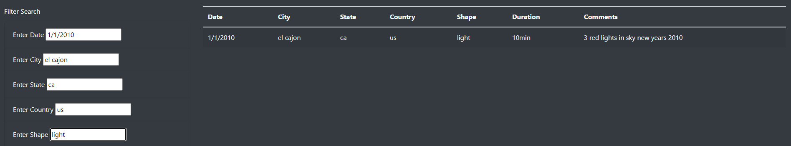

UFOs
## Deployment Link

https://hira-ayub.github.io/UFOs/

# Overview of Project:

The purpose of this project was to gain hands-on experience to create webpages with JavaScript basics. Minnville, Oregon is famous for its UFO sightings. The town even celebrates by 

having an annual gathering. This project will help Dana to build an interactive webpage that allows readers to parse the data around UFO sightings. The users can filter the information.

by date, city, state, country, or even shape.

# Results:

Once the user enters the correct values, they get the results they are looking for.

any wrong value enters, no results are displayed.

# Summary:

The webpage created included a table based on UFO sightings. It will enable users to search and filter the data for specific values. 

The drawback is that the user has to type in correct data for the filter to work. To improve the process the data filter should be changed to drop down values list so the user can get 

the information they are looking for without worrying about typing the wrong data. This could be corrected by included a drop down for the user to select the values to filter on. This 

way there is no mistake, and the information is returned correctly. currently the data is limited to the information provided, additional data should be added when new cases are 

reported. Another recommendation would be adding an additional filter that reflects on updated information from data the dataset.
